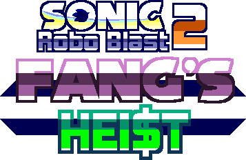

# SRB2: Fang's Heist
## Saxa/Nick's Pizza Time 2

  

This mod aims to reinvent the wheel of Pizza Time mods by offering a fun and unique experience that binds together collect-a-thon and heart-pumping fighting into one SRB2 gametype for players to enjoy.

This mod is completely reusable. Do as you wish with it!

If you want scripting/mapping help, [feel free to check the wiki](https://github.com/Saxashitter/Fangs-Heist/wiki).

Check out our [website](https://fangsheist.com/) for proper modding guides, character playbooks, and how to play the mode.

Don't forget about the lovely people who helped us with this mod. [Check the credits!](https://github.com/Saxashitter/Fangs-Heist/blob/main/CREDITS.md)

# Disclaimer
Assets were taken from _**Sonic and the Moon Facility**_ by _**StarDrop.**_ Tons of songs from _**Mamorukun Curse!**_ have been used, and we took a singular Touhou cover from _**Rumya.**_

If any of these assets should be removed from the mod, please. Let us know in the Discord.

# Development
...So, I don't know how to explain this. Can someone fill this out for me? Thanks!
